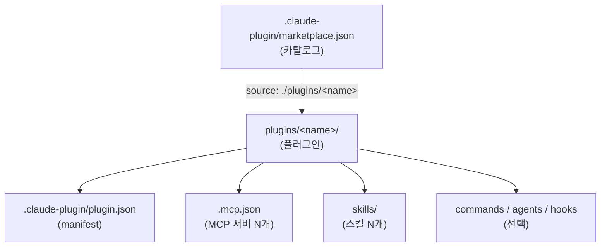
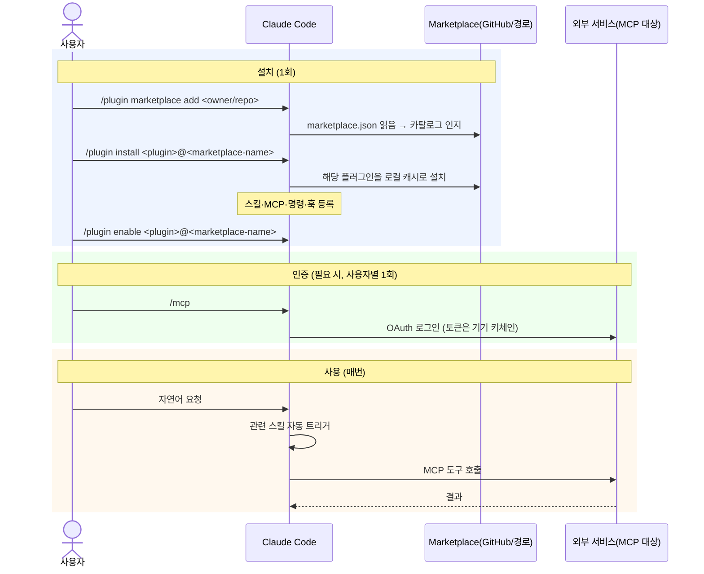

# Claude Code 마켓플레이스 / 플러그인 구조와 동작

이 저장소가 Claude Code 플러그인 마켓플레이스로서 어떻게 동작하는지 공식 문서 기반으로 정리한다.
특정 플러그인에 국한되지 않는 일반 구조를 다룬다.

## 1. 4개 개념

| 개념 | 한 줄 | 비유 |
|---|---|---|
| **MCP 서버** | 실제로 행동하는 도구(손발). 새 능력을 *추가*한다. | 칼·불 |
| **스킬(Skill)** | 도구·작업을 *어떻게 할지* 적은 설명서. 능력을 늘리진 않는다. | 레시피 |
| **플러그인(Plugin)** | 스킬·MCP·명령·훅을 담은 설치 단위. | 밀키트 |
| **마켓플레이스(Marketplace)** | 플러그인 *목록(카탈로그)*. | 매대 |

> MCP는 능력을 추가하고, 스킬은 이미 있는 도구를 잘 쓰게 한다. 플러그인은 이들을 묶고,
> 마켓플레이스는 그 플러그인을 어디서 받을지 가리킨다.

## 2. 디렉토리 구조

공식 규칙: `.claude-plugin/` 안에는 **manifest(`marketplace.json` / `plugin.json`)만** 두고,
`skills/`·`commands/`·`agents/`·`hooks/`·`.mcp.json` 등 컴포넌트는 plugin **root**에 둔다.

```
<marketplace-repo>/
├── .claude-plugin/
│   └── marketplace.json              # [카탈로그] plugins[].source 로 각 플러그인을 가리킴
└── plugins/
    └── <plugin-name>/                # [플러그인 root]
        ├── .claude-plugin/
        │   └── plugin.json           #   manifest (name + 컴포넌트 경로/설정)
        ├── .mcp.json                 #   (선택) MCP 서버 1개 이상
        ├── commands/                 #   (선택) 슬래시 명령
        ├── agents/                   #   (선택) 서브에이전트
        ├── hooks/hooks.json          #   (선택) 훅
        └── skills/
            └── <skill-name>/SKILL.md #   스킬 1개 이상
```



- 한 플러그인은 **MCP 서버 여러 개**, **스킬 여러 개**를 담을 수 있다.
- `plugin.json`의 `mcpServers`·`skills`는 문자열 경로(`"./.mcp.json"`, `"./skills/"`) 또는
  인라인 객체로 줄 수 있다.

## 3. 등록 → 설치 → 사용 (동작)



핵심:
- **설치 시점**: 마켓플레이스·플러그인이 일한다 (카탈로그 → 받아 깔기).
- **사용 시점**: 스킬·MCP만 일한다 (스킬이 가이드 → MCP가 실행).
- 설치 이름은 `<plugin>@<marketplace-name>` — 마켓플레이스 `name` 필드이지 repo명이 아니다.
- 인증이 필요한 MCP는 토큰을 repo에 넣지 않는다 — 각 사용자가 `/mcp`로 로그인, 토큰은 기기에만.

## 4. 팀 자동 설치 (선택)

소비 프로젝트의 `.claude/settings.json`에 박아두면, 그 repo를 여는 사람에게 자동 적용된다
(신뢰 승인 1회).

```json
{
  "extraKnownMarketplaces": {
    "<marketplace-name>": {
      "source": { "source": "github", "repo": "<owner>/<repo>" }
    }
  },
  "enabledPlugins": { "<plugin>@<marketplace-name>": true }
}
```

## 5. 검증 / 테스트

```sh
claude plugin validate .                    # 마켓플레이스(marketplace.json) 스키마
claude plugin validate ./plugins/<name>     # 개별 플러그인 manifest + 컴포넌트
claude --plugin-dir ./plugins/<name>        # 로컬에서 실제 로드 테스트
```

> ⚠️ `validate` 통과는 **문법/스키마**만 보장한다. MCP 실제 연결·OAuth·도구 호출은
> 런타임에 확정되므로, 배포 전 `--plugin-dir` 또는 로컬 install로 한 번 돌려보는 게 안전하다.

## 6. 공식 레퍼런스

| 주제 | 문서 |
|---|---|
| 플러그인 개요 | https://code.claude.com/docs/en/plugins |
| 플러그인 매니페스트/필드 레퍼런스 (`mcpServers`·`skills`가 `string\|array\|object`, 스킬 자동 발견, 네임스페이싱) | https://code.claude.com/docs/en/plugins-reference |
| 마켓플레이스 (`marketplace.json` 위치·스키마, `<plugin>@<name>` 설치, `validate` 범위) | https://code.claude.com/docs/en/plugin-marketplaces |
| MCP (플러그인 MCP 자동 시작, `type:http`, 다중 서버, `/mcp` OAuth) | https://code.claude.com/docs/en/mcp |
| 팀 자동 설치 (`extraKnownMarketplaces`, `enabledPlugins`) | https://code.claude.com/docs/en/discover-plugins |
