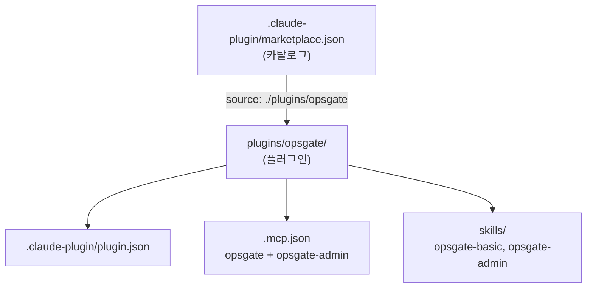
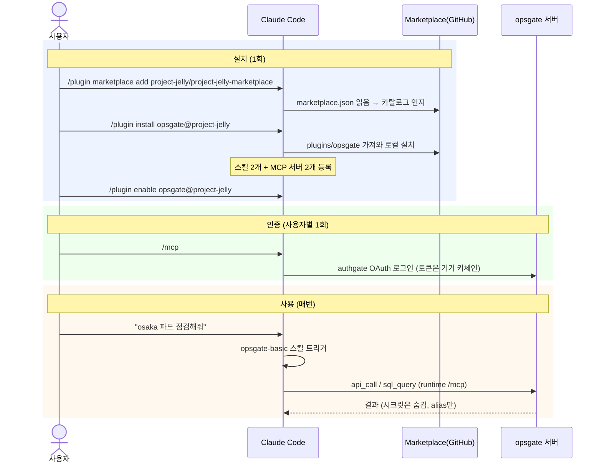

# Marketplace / Plugin 구조와 동작

이 저장소가 Claude Code 플러그인 마켓플레이스로 어떻게 동작하는지 공식 문서 기반으로 정리한다.

## 1. 4개 개념

| 개념 | 한 줄 | 이 repo에서 |
|---|---|---|
| **MCP 서버** | 실제로 행동하는 도구(손발) | `opsgate` / `opsgate-admin` (원격 HTTP) |
| **스킬(Skill)** | 그 도구를 *어떻게 쓸지* 적은 설명서 | `opsgate-basic`, `opsgate-admin` |
| **플러그인(Plugin)** | 스킬 + MCP를 담은 설치 단위 | `plugins/opsgate/` |
| **마켓플레이스(Marketplace)** | 플러그인 *목록(카탈로그)* | `.claude-plugin/marketplace.json` |

> MCP는 능력을 *추가*하고, 스킬은 이미 있는 도구를 *잘 쓰게* 한다. 플러그인은 둘을 묶고,
> 마켓플레이스는 그 플러그인을 어디서 받을지 가리킨다.

## 2. 디렉토리 구조

공식 규칙: `.claude-plugin/` 안에는 **manifest(`marketplace.json` / `plugin.json`)만** 두고,
`skills/`·`.mcp.json` 등은 plugin **root**에 둔다.

```
project-jelly-marketplace/            # 마켓플레이스 repo
├── .claude-plugin/
│   └── marketplace.json              # [카탈로그] plugins[].source 로 각 플러그인 가리킴
└── plugins/
    └── opsgate/                      # [플러그인 root]
        ├── .claude-plugin/
        │   └── plugin.json           #   manifest (name, mcpServers, skills, ...)
        ├── .mcp.json                 #   MCP 서버 2개 (runtime + admin)
        └── skills/
            ├── opsgate-basic/SKILL.md   # 평소 사용 (read/query)
            └── opsgate-admin/SKILL.md   # 등록할 때만 (credential lifecycle)
```



## 3. 등록 → 설치 → 사용 (동작)



핵심:
- **설치 시점**엔 마켓플레이스·플러그인이 일한다 (카탈로그 → 받아 깔기).
- **사용 시점**엔 스킬·MCP만 일한다 (스킬이 가이드 → MCP가 실행).
- 설치 이름은 `플러그인@마켓플레이스name` = `opsgate@project-jelly` (repo명 아님).
- 시크릿은 repo에 없음 — OAuth 토큰은 각 사용자 기기에만.

## 4. 두 MCP 서피스 (왜 한 플러그인에 2개)

opsgate `/mcp`와 `/mcp/admin`은 **권한 게이트가 아니라 노출 도구 목록으로만 분리**된다
(동일 인증 사용자). 그래서 별도 플러그인이 아니라 **한 플러그인이 둘 다 연결**한다.

```
opsgate        (/mcp)        → 평소 사용: api_call, sql_query, sql_schema, credential_list, me
opsgate-admin  (/mcp/admin)  → 등록할 때만: credential_register/update/delete, credential_list, me
```

## 5. 공식 레퍼런스

| 주제 | 문서 |
|---|---|
| 플러그인 개요 | https://code.claude.com/docs/en/plugins |
| 플러그인 매니페스트/필드 레퍼런스 (`mcpServers`·`skills`가 `string\|array\|object`, 스킬 자동 발견, 네임스페이싱) | https://code.claude.com/docs/en/plugins-reference |
| 마켓플레이스 (`marketplace.json` 위치·스키마, `plugin@name` 설치, `validate` 범위) | https://code.claude.com/docs/en/plugin-marketplaces |
| MCP (플러그인 MCP 자동 시작, `type:http`, 다중 서버, `/mcp` OAuth) | https://code.claude.com/docs/en/mcp |

검증 명령:

```sh
claude plugin validate .                 # 마켓플레이스(marketplace.json) 스키마
claude plugin validate ./plugins/opsgate # 개별 플러그인 manifest + 컴포넌트
claude --plugin-dir ./plugins/opsgate    # 로컬에서 실제 로드 테스트
```

> ⚠️ `validate` 통과는 **문법/스키마**만 보장한다. MCP 실제 연결·OAuth·tool 호출은
> 런타임에 확정되므로, 배포 전 `--plugin-dir` 또는 로컬 install로 한 번 돌려보는 게 안전하다.
